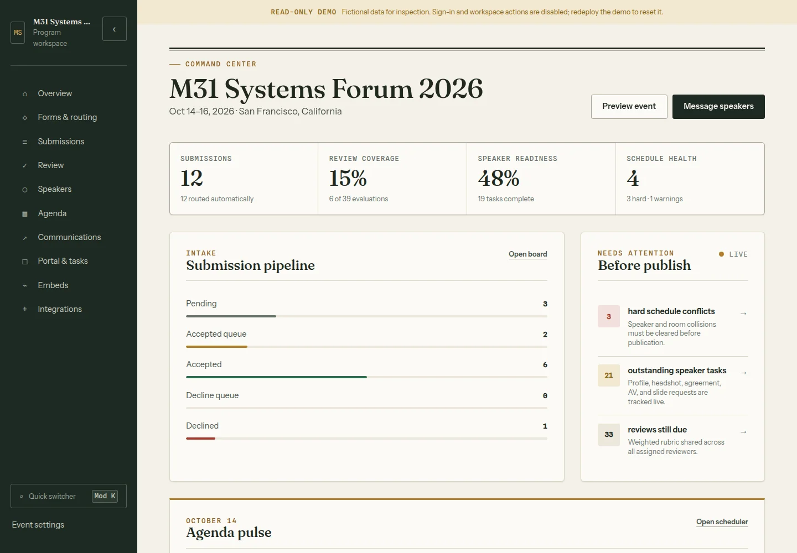

# Rostrum

<!-- markdownlint-disable MD013 -->

[](https://github.com/M31-Labs/rostrum/actions/workflows/ci.yml)
[](https://m31-labs.github.io/rostrum/)
[](go.mod)
[](LICENSE)

**Run the whole speaker program from one calm, accountable workspace.**

Rostrum is a self-hosted, MIT-licensed operating system for event speaker
programs. A proposal moves from an open call through governed routing, human
review, speaker readiness, conflict-aware scheduling, and public publishing.
The decisions that matter keep their rule, reason, and audit context.


## Evaluator fast path

The repository is the authoritative evaluation artifact. Choose the path that
matches what you want to test:

| Path | Best for | Mutations | Setup |
| --- | --- | --- | --- |
| **Local judge demo — recommended first** | Verified visual/persona tour of the exact source tree | No; deliberately read-only | Go 1.26, Make, `curl`, and a POSIX shell; one command |
| **Fresh interactive run** | Organizer setup and end-to-end feature testing from a clean workspace | Yes | Go 1.26 and Make; about one minute |
| **Hosted preview** | A quick visual tour when the deployment preflight passes | No; deliberately read-only | None |

### Launch the deterministic judge demo

```bash
git clone https://github.com/M31-Labs/rostrum.git
cd rostrum
make judge-demo
```

The helper builds into a disposable directory, prepares the fictional
evaluation fixture from [`examples/demo/`](examples/demo/README.md), boots it
through generic read-only preview mode, runs the full smoke contract, and
prints every evaluation URL. Start at the guided
[product tour](http://127.0.0.1:8080/tour). Press `Ctrl-C` to remove the process
and generated workspace.

### Run a fresh interactive workspace locally

```bash
git clone https://github.com/M31-Labs/rostrum.git
cd rostrum
APP_MODE=live make dev
```

Rostrum prints a one-time first-organizer URL to the terminal:

```text
Rostrum has no organizer yet. Finish setup at: http://localhost:8080/setup?token=...
```

Open that exact URL, enter a name and email address, and Rostrum creates the
first organizer and signs that browser in. No email provider or external
credential is needed. `make dev` uses an in-memory `INITIAL_WORKSPACE=fresh`
store, so a restart discards it. The starter contains one editable CFP and no
fictional speakers, proposals, reviews, or sessions. Follow the
[self-hosting manual](docs/self-hosting.md) for a durable organizer workspace.

Then visit:

- [Guided product tour](http://localhost:8080/tour)
- [Organizer workspace](http://localhost:8080/organizer)
- [Starter call for speakers](http://localhost:8080/submit/call-for-proposals)
- [Public agenda](http://localhost:8080/public/your-event/agenda)
- [Public API directory](http://localhost:8080/api/v1/workspace)

Press `Ctrl/Cmd K` inside the workspace for the switcher, or press `G` followed
by a route key such as `A` for Agenda or `R` for Review.

### Use the hosted preview

The intended preview is
[rostrum.m31labs.dev](https://rostrum.m31labs.dev). It is a separate,
fictional, anonymous, read-only deployment. Because a hosted deployment can
lag the repository, run this preflight before relying on it:

```bash
curl -fsS https://rostrum.m31labs.dev/api/health
curl -fsS https://rostrum.m31labs.dev/api/v1/workspace
```

A judge-ready preview reports an immutable Rostrum version (not `dev`), the
event slug `m31-systems-forum-2026`, and non-zero published session and speaker
counts. Its `/organizer` route opens without sign-in and responses include
`X-Robots-Tag: noindex, nofollow, noarchive`. If any check differs, use the
[local judge demo](#launch-the-deterministic-judge-demo) for the same fictional
workspace, or the [fresh interactive path](#run-a-fresh-interactive-workspace-locally)
when you need mutations.

The complete five-minute route and expected evidence are in the
[judging guide](docs/judging-guide.md).

## See the handoffs, not a feature maze

The `/tour` route follows five people through the same record: organizer,
submitter, reviewer, speaker, and attendee. In the correctly configured
read-only evaluation preview it also issues signed, persona-scoped links so
judges can inspect the reviewer desk and speaker portal while the independent
preview gate still rejects every mutation.

| Organizer command center | Published speaker experience |
| --- | --- |
|  |  |

Every capture is generated from the deterministic fictional fixture. The
approved example portraits are synthetic assets under `examples/demo/`, never
real speaker data; their initials fallbacks also demonstrate the
publication-consent gate.

## One record, the whole program

1. **Collect.** Run one or more calls for speakers with editable fields,
   constrained conditional questions, drafts, withdrawal, and server-enforced
   open/close state.
2. **Route and review.** Arbiter policies assign queue, owner, and track with a
   readable trace. Weighted, multi-round human review keeps scores attributed
   and enforces assignment and quorum rules.
3. **Prepare and schedule.** Signed speaker portals collect profiles, tasks,
   headshots, and files. Organizers schedule accepted sessions while hard room
   and speaker collisions block publication.
4. **Publish and operate.** The committed schedule powers the public agenda,
   speaker gallery, personal itinerary, calendars, embeds, public JSON, and
   organizer exports.

## Capability map

| Surface | What is implemented now |
| --- | --- |
| Forms and routing | Multiple CFPs, editable/reorderable fields, equals/show conditions, close dates, drafts, withdrawal, versioned Arbiter policies, readable routing traces |
| Review | Multi-round weighted rubrics, reviewer rosters, signed reviewer links, balanced assignments, company-conflict exclusions, quorum-governed decisions |
| Speakers and portal | Signed passwordless links, profiles, scoped tasks, file/headshot upload, approval, private downloads, per-speaker calendar |
| Agenda | Unscheduled bank, manual sessions, drag and keyboard movement, day/week/track/room views, hard conflicts, warnings, publication gate |
| Communications | Editable templates and revisions, merge preview, durable outbox, retry/backoff, suppression, Gmail/Outlook handoff, Resend or SMTP transport |
| Public output | Agenda, gallery, device-local itinerary, embeddable public pages, read-only JSON API, whole-event calendar |
| Operations | JSON, SQLite WAL, or Postgres storage; checksummed export/import; full archives; approved-upload bundle; independent hash-chained audit ledger |
| External publishing | Credential-free Accelevents and Airtable dry runs; explicit one-way publishing with a visible run ledger; Rostrum remains canonical |

See the [capability and evidence matrix](docs/judging-guide.md#capability-and-evidence-matrix)
for routes, tests, and the boundary of each claim.

## People and access

| Persona | Access model |
| --- | --- |
| Organizer | Application session with the `organizer` role; full workspace access |
| Chair | Organizer-facing access plus governed final-decision and sensitive export authority |
| Observer | Read-only organizer-facing access; no mutation or PII-bearing export |
| Reviewer | Signed, expiring link scoped to that reviewer |
| Speaker | Signed, expiring link scoped to that speaker and their portal |
| Attendee | Public agenda, gallery, itinerary, and published JSON only |

Organizers can bootstrap once through `/setup`, then sign in with a magic link,
a configured GitHub or Google OAuth provider, or a registered passkey. See
[deployment: identity and access](docs/deployment.md#identity-and-access).

## Trust is part of the feature

- **Explainable policy.** Routing, review governance, form visibility, and
  schedule-conflict rules live in versioned files under [`rules/`](rules/).
- **Public means published.** Public JSON includes only published sessions and
  their speakers—not emails, proposal text, review data, drafts, or provider
  configuration.
- **Defensive persistence.** State is validated before replacement. JSON uses
  atomic writes; SQLite uses WAL; Postgres uses the same aggregate contract.
- **Independent history.** Durable mutations are also written to a separate,
  fsynced, hash-chained JSON Lines ledger. The state write and ledger append
  are deliberately documented as two operations, not a distributed
  transaction.
- **Small public edge.** CSRF protection, signed sessions, role checks, upload
  allow-lists, request-body limits, public-form rate limits, route-aware CSP,
  and production startup guards are covered by tests.

Read the [architecture and security notes](docs/architecture.md) for the full
boundary and current limitations.

## Public interfaces

| Endpoint | Returns | Cache |
| --- | --- | --- |
| `GET /api/health` | App name, deployment-owned version, UTC timestamp | public, 30 seconds |
| `GET /api/v1/workspace` | Event metadata, published counts, discovery links | public, 60 seconds |
| `GET /api/v1/schedule` | Published sessions only | public, 60 seconds |
| `GET /api/v1/speakers` | Speakers attached to published sessions only | public, 60 seconds |
| `GET /public-calendar/{event}.ics` | Complete published program calendar | public, 60 seconds |
| `GET /calendar/{speaker}.ics` | Private signed/bound speaker calendar | private, 60 seconds |
| `GET /organizer/export/submissions.csv` | Organizer/chair submission export | private, no-store |
| `GET /organizer/export/workspace.json` | Checksummed workspace envelope | private, no-store |
| `GET /organizer/export/archive.tar.gz` | Workspace, uploads, and audit segments | private, no-store |

Examples and response contracts live in [docs/api.md](docs/api.md).

## Development and verification

The runtime needs only Go. The full contributor gate also pins GoSX and
Arbiter:

```bash
go install m31labs.dev/gosx/cmd/gosx@v0.38.1
go install m31labs.dev/arbiter/cmd/arbiter@v1.9.0

make check          # formatting, policy validation, vet, tests, race tests
make build          # production bundle in dist/
make smoke          # verify the fictional read-only preview contract
make judge-demo     # verify, launch, print judge URLs, clean up on Ctrl-C
make release-check  # check, size-budget build, and full example smoke
```

The app is server-rendered with GoSX. It ships no hand-written browser
JavaScript; focused GoSX islands supply the workspace switcher, agenda board,
conditional form fields, link-copy helpers, and public itinerary. The build
enforces [`size-budget.json`](size-budget.json) and
[`perf-budget.json`](perf-budget.json).

## Documentation

- [Published documentation site](https://m31-labs.github.io/rostrum/)
- [Documentation home](docs/index.md)
- [Judge and organizer guide](docs/judging-guide.md)
- [Fictional evaluation-preview example](examples/demo/README.md)
- [Architecture, security, and limitations](docs/architecture.md)
- [API reference](docs/api.md)
- [Self-hosting manual](docs/self-hosting.md)
- [Deployment reference](docs/deployment.md)
- [Launch-readiness gate](docs/launch-readiness.md)
- [Visual system](docs/visual-system.md)
- [Contributing](.github/CONTRIBUTING.md) · [Security](.github/SECURITY.md) ·
  [Support](.github/SUPPORT.md)

Questions, collaboration, or implementation work belong with
[M31 Labs](https://m31labs.dev/build), not a maintainer's personal inbox.

## Current scope

One Rostrum instance operates one organization's event workspace. It is not a
multi-tenant SaaS control plane. The hosted preview is inspection-only; use a
local run for mutations. Real email delivery, external databases, and live
Accelevents/Airtable publishing require operator-owned credentials and
acceptance testing.

## License

[MIT](LICENSE) © 2026 M31 Labs contributors.
