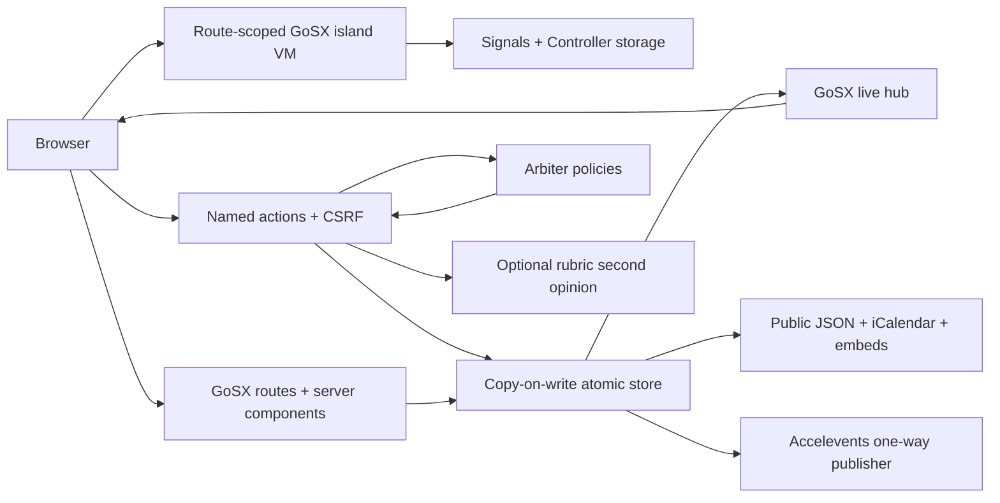

# Programma

**A calm operating system for complicated event programs.**

Programma is a GoSX-native, open-source SaaS foundation for calls for speakers,
multi-round review, speaker onboarding, conflict-aware scheduling, and public
program publishing. It implements the complete workflow in the supplied
[Sessionboard-style product brief](https://docs.google.com/document/d/1rBHJtiNKHv4i43tdf2Rm0sDEYuIcajhmAPoBKR_Az-A/edit)
while making a different bet: workflow automation should be governed,
inspectable, and reversible.

The demo event is **M31 Systems Forum 2026**. It is intentionally dense enough
to show the product under real operational pressure, including conditional
intake, competing rooms and speakers, incomplete onboarding, multi-round
rubrics, external publishing, and an optional AI second opinion.

## Why this submission is different

- **Decisions are product data.** Arbiter policies control CFP routing,
  conditional questions, and scheduling severity; the UI exposes the rule and
  human-readable trace.
- **AI remains visibly subordinate.** Human evaluations alone determine review
  coverage and aggregate scores. OpenAI assistance uses the same organizer
  rubric, excludes speaker PII, returns a strict schema, and retains provider
  and model provenance.
- **One canonical program.** A committed schedule feeds speaker portals,
  mobile embeds, JSON, iCalendar, and a deliberate one-way Accelevents export.
- **A useful zero-credential mode.** The full judging path runs with an atomic
  JSON store, deterministic AI preview, demo outbox, integration dry runs, and
  no paid infrastructure.
- **No bespoke browser JavaScript.** GoSX server components, named Actions,
  focused binary islands, Controllers, and Hubs own the whole interaction
  model. The only browser JavaScript shipped is GoSX's generic runtime.
- **Fast at operator speed.** A searchable quick switcher, route chords, and a
  persistent compact rail make every organizer surface reachable without a
  reload or a trip through nested menus.

## Capability coverage

| Brief requirement | Programma evidence |
|---|---|
| Conditional CFP and category routing | `/organizer/forms`, `/submit/systems-forum-cfp`, `rules/cfp-routing.arb`, `rules/form-visibility.arb` |
| Speaker profiles, headshots, slides, and documents | `/portal/{speaker}`, guarded uploads, organizer readiness matrix |
| Templates, reminders, Gmail/Outlook, calendar invites | `/organizer/communications`, provider handoff ledger, compose links, per-speaker `.ics` |
| Multi-round scoring and optional AI review | `/organizer/review`, weighted human rubric entry, provenance-labeled second opinions |
| Drag/drop agenda and conflict detection | `/organizer/agenda` with list/day/week/track/room views and Arbiter-backed hard/soft decisions |
| Real-time onboarding dashboard | `/organizer/portal` over a GoSX WebSocket hub |
| One-way Accelevents integration | `/organizer/integrations`, offline dry run, explicit credential-gated live publish, sync ledger |
| Portal wiki/resources and HTML embeds | allowlisted article/link/embed resource catalog in every speaker portal |
| Mobile gallery, schedule, itinerary | `/public/m31-systems-forum-2026/agenda` and `/speakers`, embeddable and backed by public JSON |

The detailed acceptance mapping is in [the product specification](docs/product-spec.md).

## Run locally

Requirements: Go 1.26 or newer. No database or external credential is required.

```bash
cp .env.example .env
go run .
```

Open [http://localhost:8080](http://localhost:8080). The default JSON workspace
is created at `data/programma.json`. To run a disposable, always-clean demo:

```bash
DEMO_MODE=memory go run .
```

Useful entry points:

- Organizer home: [http://localhost:8080/organizer](http://localhost:8080/organizer)
- Public CFP: [http://localhost:8080/submit/systems-forum-cfp](http://localhost:8080/submit/systems-forum-cfp)
- Speaker portal: [http://localhost:8080/portal/spk_maya](http://localhost:8080/portal/spk_maya)
- Public agenda: [http://localhost:8080/public/m31-systems-forum-2026/agenda](http://localhost:8080/public/m31-systems-forum-2026/agenda)

## Five-minute demo

1. Start on **Today** and show submission, review, onboarding, and schedule
   health in one operating view.
2. Open **Forms & routing**; inspect the workshop-only logistics rule and the
   category-to-owner decision trace. Submit a new workshop through the public
   CFP and land directly in its new speaker portal.
3. Update the profile and complete a task. Open **Portal & tasks** in another
   tab to show live readiness updates.
4. In **Review**, record a human weighted rubric, then add an optional AI second
   opinion. Point out that the AI result is labeled and does not change human
   coverage or the human aggregate.
5. In **Agenda**, switch among day, week, track, and room views. Attempt a
   collision, inspect the governing reason, and publish only after hard
   conflicts are gone.
6. Preview Gmail/Outlook handoff and download an iCalendar invite. Finish with
   the mobile agenda/gallery and the Accelevents dry run or configured live
   publish ledger.

## Architecture



The store validates a cloned next state before atomically replacing the data
file. External calls occur outside store locks. Live updates are broadcast only
after a durable mutation succeeds.

### Interaction model

- `Ctrl/Cmd K` opens the searchable workspace switcher. Arrow keys and Enter
  navigate it, Escape and backdrop clicks close it, and the same control stays
  visible and touchable in the mobile organizer shell.
- `G` followed by the visible route key jumps directly to an organizer surface;
  `[` toggles the desktop rail between its full and 76 px modes. Chords are
  deliberately inert while a user is typing, and rail preference persists.
- GoSX's navigation runtime upgrades internal links and managed forms into
  same-document page swaps with History API semantics. Every route still
  renders complete HTML and works through native navigation without JavaScript.
- Mutations invalidate prefetched page state before they run. Managed requests
  receive a JSON action result and soft redirect; native form posts retain the
  standard `303 See Other` flow.
- CSRF stays enforced for managed forms, agenda drag/drop, and native posts.
  Validation errors return to the originating form, announce through an ARIA
  live region, and focus the first invalid control.
- WebSocket updates refresh the affected server-rendered view through the same
  soft-navigation path, preserving scroll and avoiding a document reload.
- Reduced-motion preferences, keyboard move controls, native constraint
  validation, and hard-navigation fallbacks are preserved throughout.

## Optional adapters

### OpenAI review assistance

Set `OPENAI_API_KEY` to replace the deterministic offline rubric preview with a
live Responses API call. Programma sends proposal content and the
organizer-authored rubric—not speaker email, profile, onboarding, or private
review data. Requests use strict structured output, `store: false`, a stable
hashed safety identifier, bounded output, and explicit refusal/error handling.

```bash
OPENAI_API_KEY=... OPENAI_MODEL=gpt-5.6-terra go run .
```

### Accelevents

Dry runs need no secret. Live publishing is unlocked only when an API key is
present and always sends speakers before scheduled sessions.

```bash
ACCELEVENTS_API_KEY=... \
ACCELEVENTS_EVENT_URL=m31-systems-forum-2026 \
go run .
```

The adapter uses stable Programma IDs as external IDs, stops on the first
remote error, and records completed or failed runs in the visible ledger.

## Public interfaces

| Endpoint | Purpose | Cache |
|---|---|---|
| `GET /api/health` | Runtime health and GoSX version | 30 seconds |
| `GET /api/v1/workspace` | Public discovery links and counts | 60 seconds |
| `GET /api/v1/schedule` | Published sessions only | 60 seconds |
| `GET /api/v1/speakers` | Speakers attached to published sessions only | 60 seconds |
| `GET /calendar/{speaker}.ics` | Private per-speaker schedule download | private, 60 seconds |
| `GET /organizer/export/submissions.csv` | Organizer CSV export | private, no-store |

Public JSON deliberately excludes email addresses, proposal bodies, review
plans, evaluations, task state, upload paths, and draft sessions.

## Verify and build

This development snapshot intentionally consumes the adjacent live GoSX
worktree through the `replace m31labs.dev/gosx => ../gosx-programma-islands`
directive in `go.mod`. It does not vendor the framework. Build a matching CLI
from that worktree and install Arbiter if it is not already on the path:

```bash
cd ../gosx-programma-islands
go build -o ./bin/gosx ./cmd/gosx
cd ../programma
go install m31labs.dev/arbiter/cmd/arbiter@v1.9.0
```

Then run:

```bash
make check GOSX=../gosx-programma-islands/bin/gosx
make release-check GOSX=../gosx-programma-islands/bin/gosx

# With the disposable demo running on its default port:
make perf-budget GOSX=../gosx-programma-islands/bin/gosx
```

`make check` covers Go formatting, GoSX parsing/formatting, Arbiter policy
validation, `go vet`, unit tests, and the race detector. `make release-check`
adds a production build and rejects growth beyond [the committed byte
budgets](size-budget.json). `make perf-budget` profiles the five representative
routes under a Pixel 7 viewport and 4× CPU throttle against
[the runtime budgets](perf-budget.json).

The current production envelope is intentionally explicit:

| Constraint | Measured | Ceiling |
|---|---:|---:|
| Bespoke application JavaScript | 0 files / 0 B | 0 files / 0 B |
| Application CSS, gzip | 13,690 B | 14,500 B |
| Largest static route | 140,050 B raw / 24,815 B gzip | 145,000 B / 26,000 B |
| Largest island program | 11,883 B raw / 4,262 B gzip / 3,301 B Brotli | 12,500 B / 4,500 B / 3,500 B |
| Largest route-scoped client transfer | 406,749 B gzip / 327,830 B Brotli | 420,000 B / 335,000 B |
| GoSX cold-start runtime | 665,477 B gzip / 505,830 B Brotli | 675,840 B / 520,000 B |
| Complete distribution | 68,214,273 B | 70,000,000 B |

The public root remains navigation-only and references no external GoSX client
asset. Organizer routes load the shared island VM, `WorkspaceChrome`, and the
rail-persistence Controller; Today and Portal additionally load Hub refresh.
Agenda adds its board island, and the dynamic public agenda loads only its
itinerary island plus storage Controller. Six representative route contracts
fail the build on any unexpected capability. Production contains five compact
`.gxi` programs, with `WorkspaceChrome` the largest. `make build` writes the
ignored `dist/` bundle and reproducibly removes generated sourcemaps and copied
Go sources that are not needed at runtime.
The independent [Buckley / Qwen 3.8 Max review](docs/reviews/qwen-3.8-max.md)
records the model result and the evidence used to close each follow-up.

## Deploy

The included runtime Dockerfile consumes the verified `dist/` bundle, runs as a
non-root user, and keeps only the binary, route templates, used GoSX assets,
public assets, timezone data, and CA roots. See
[deployment guidance](docs/deployment.md) for a container run command,
persistent volume, production secret requirements, and reverse-proxy boundary.

This repository is a submission-grade single-workspace vertical slice, not a
finished multi-tenant control plane. Before serving unrelated organizations,
add tenant-scoped identity and authorization, a multi-instance transactional
store, object storage, background delivery workers, audit retention, and billing.
The organizer and speaker routes should be placed behind an identity-aware
proxy or equivalent access layer in any production demonstration.

## License

MIT. See [LICENSE](LICENSE).
