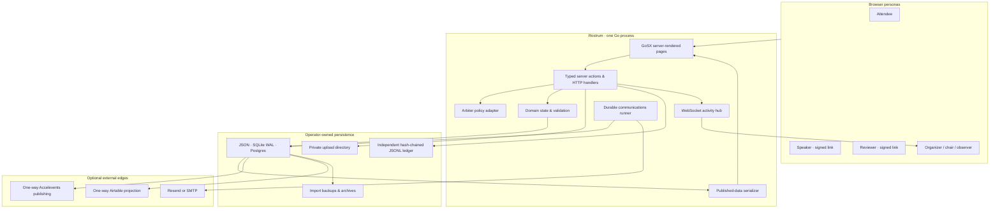
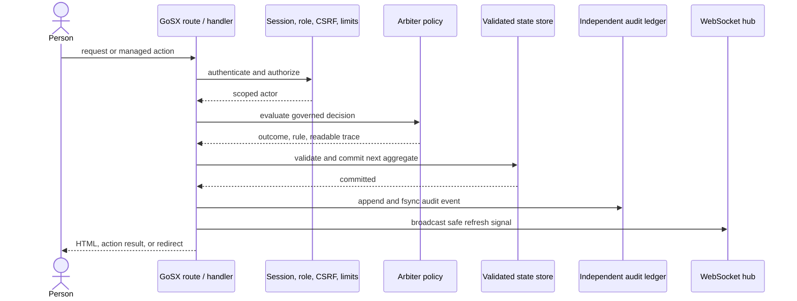

# Architecture, security, and limitations

<!-- markdownlint-disable MD013 -->

Rostrum is a single Go application organized around one validated event
workspace. Pages, actions, public JSON, live updates, and exports all project
from that same canonical state.

## System view

There is no separate front-end application or worker deployment. The GoSX
runtime provides managed navigation and a small set of generated islands; the
repository contains no hand-written browser JavaScript. A process-local loop
wakes the durable communications outbox, but due time, leases, retry state,
idempotency, cancellation, and suppression remain in canonical state.

## Request and decision flow

The state commit and independent ledger append are intentionally separate. If
the state commits and the ledger filesystem then fails, Rostrum returns an
error that says the workspace commit already succeeded. This is an operational
incident to reconcile, not an atomic transaction across two stores.

## Source structure

| Concern | Location | Responsibility |
| --- | --- | --- |
| Pages and server actions | [`app/`](https://github.com/M31-Labs/rostrum/tree/main/app/) | File routes, `.gsx` components, loaders, managed mutations |
| HTTP assembly | [`main.go`](https://github.com/M31-Labs/rostrum/blob/main/main.go) | Middleware, API, mounted downloads/uploads, identity, process startup |
| Domain | [`internal/domain/`](https://github.com/M31-Labs/rostrum/tree/main/internal/domain/) | Aggregate types, fresh/empty state, invariants, review and conflict helpers |
| Presentation | [`internal/present/`](https://github.com/M31-Labs/rostrum/tree/main/internal/present/) | Safe view models for pages |
| Storage | [`internal/store/`](https://github.com/M31-Labs/rostrum/tree/main/internal/store/) | JSON, SQLite, Postgres, read-only and audit decorators |
| Policy | [`rules/`](https://github.com/M31-Labs/rostrum/tree/main/rules/) | CFP routing, form visibility, review governance, schedule conflicts |
| Identity | [`internal/identity/`](https://github.com/M31-Labs/rostrum/tree/main/internal/identity/) | Organizer magic links, OAuth, passkeys, setup |
| Signed access | [`internal/token/`](https://github.com/M31-Labs/rostrum/tree/main/internal/token/) | Purpose-separated speaker and reviewer tokens |
| Public boundary | [`internal/publicapi/`](https://github.com/M31-Labs/rostrum/tree/main/internal/publicapi/) | Published schedule and speaker serialization |
| Communications | [`internal/communications/`](https://github.com/M31-Labs/rostrum/tree/main/internal/communications/), [`internal/mail/`](https://github.com/M31-Labs/rostrum/tree/main/internal/mail/) | Durable runner and provider transports |
| Recovery | [`internal/archive/`](https://github.com/M31-Labs/rostrum/tree/main/internal/archive/) | Checksummed workspace and approved-upload artifacts |

## Persistence model

Rostrum exposes one state-store contract with three canonical backends:

- **JSON (default):** validates a cloned next state, writes a temporary file,
  and atomically replaces the workspace file. It is the zero-configuration
  path.
- **SQLite:** persists the same aggregate contract with WAL enabled. It is a
  practical single-host option.
- **Postgres:** persists the same contract through `DATABASE_URL`. The exact
  managed endpoint still needs operator backup, restore, and restart testing.

Uploads remain private files outside the aggregate. Their state references are
validated against the upload root. `AUDIT_LOG_PATH` is deliberately separate
from `DATA_PATH`; `BACKUP_DIR` stores exact pre-import backups.

Rostrum should run as one application replica for JSON and SQLite. A Postgres
deployment should still remain single-replica until an operator has explicitly
validated shared identity, live-update, rate-limit, and outbox behavior for a
multi-process topology.

## Identity and authorization boundaries

| Surface | Required authority |
| --- | --- |
| `/public/*`, public CFP, `/api/v1/*` | Anonymous, subject to publication and rate-limit rules |
| `/organizer/*` | `organizer`, `chair`, or `observer`; `APP_MODE=preview` is a special anonymous read-only posture |
| Sensitive organizer exports | `organizer` or `chair`; never `observer` |
| Final governed decision override | `chair`, with rationale and audit context |
| `/review/{token}` | Valid signed reviewer token on each request |
| `/portal/{speaker}` and private files | Matching signed token or bound speaker session; organizer session where explicitly allowed |
| `/calendar/{speaker}.ics` | Matching signed token, bound speaker session, or organizer-facing session |
| `/setup` | One-time process token, only while no organizer exists |

Organizer sessions are signed and encrypted by GoSX using `SESSION_SECRET`.
Production startup rejects a default/short secret, a non-HTTPS `PUBLIC_URL`,
and in-memory persistence. Non-local public URLs also require a strong session
secret even if `APP_ENV` was misconfigured.

## Public-data contract

`internal/publicapi` constructs public responses from an allow-list. It emits
event metadata, published sessions, and speakers attached to those sessions.
The public whole-event calendar is built from that same published-session
boundary. Neither path serializes speaker email, proposal answers, review
records, draft sessions, upload paths, principals, audit events, or provider
configuration.

Public pages may be framed so organizers can embed the agenda. Other routes
send a `frame-ancestors 'none'` content-security policy. The global security
layer also supplies content-type protection, a permissions policy, referrer
policy, and HSTS on HTTPS.

## Mutation defenses

- Managed forms use CSRF protection and server-side validation.
- Public form and magic-link requests have session/IP rate limits.
- Non-upload bodies are capped at 1 MiB; uploads use a 12 MiB request envelope
  and a 10 MiB file limit.
- Upload extensions and MIME types are allow-listed, filenames are sanitized,
  and stored paths are rechecked beneath the private upload root.
- Spreadsheet exports neutralize formula prefixes.
- Preview mode rejects unsafe methods and sensitive paths at middleware,
  then wraps the store in a second read-only barrier.
- Preview startup verifies the configured workspace template against its
  required SHA-256 pin and refuses credentials or unsafe persistence
  configuration. It also rejects an email-like value anywhere in the complete
  workspace unless its domain is `example.com`, `example.net`, `example.org`,
  or one of their subdomains.

## Current limitations

- One instance represents one organization's event workspace. There is no
  multi-tenant SaaS account plane.
- The anonymous hosted preview is intentionally non-mutating. Safe navigation,
  filtering, and persona inspection remain interactive, and the public CFP
  renders a client-only submit walkthrough so judges can type, save a draft,
  and submit a proposal without creating a request, email, or workspace record.
  Fresh live mode is the evaluation path for real mutations.
- Provider unit/contract tests do not prove real email, Accelevents, or
  Airtable delivery. Operators must run the provider acceptance steps in the
  self-hosting manual with the exact credentials and endpoint they select.
- Rate-limit counters and the WebSocket hub are process-local.
- Full-archive upload recovery is a stopped-process procedure. Structured
  workspace JSON import is validated online, but archive extraction is not.
- The independent ledger cannot participate in the canonical store's atomic
  commit; its post-commit failure has an explicit incident path.
- The public API is a small read-only v1 contract, not an OpenAPI-described
  mutation API.
- Deployment manifests provide a secure single-instance baseline, not a
  turnkey managed service or an availability SLA.

## Verification layers

| Layer | Command | Proves |
| --- | --- | --- |
| Static and unit | `make check` | Formatting, GoSX formatting, Arbiter validation, vet, tests, race tests |
| Evaluation-preview contract | `make smoke` | Generated fictional fixture, anonymous organizer/persona/public/embed/API/calendar surfaces, no-index headers, and mutation refusal |
| Bundle contract | `make size-budget` | Production build and committed route/runtime size ceilings |
| Remote preview | `make smoke SMOKE_URL=https://… SMOKE_EXPECTED_VERSION=<release>` | The same full read-only example contract and exact immutable release; not external-provider acceptance |
| Operator acceptance | [Launch runbook](launch-readiness.md#release-verification-runbook) | Exact image, deployment, credentials, storage, recovery, and approval evidence |
