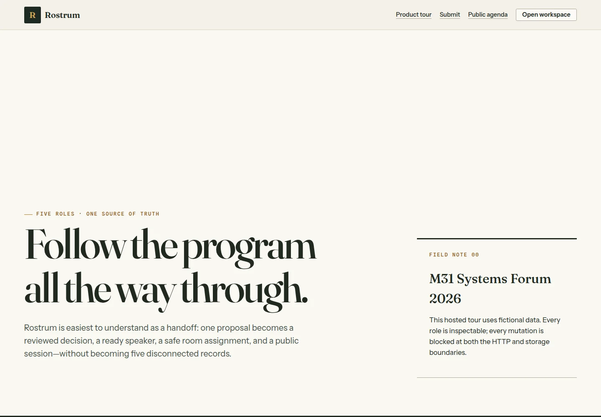
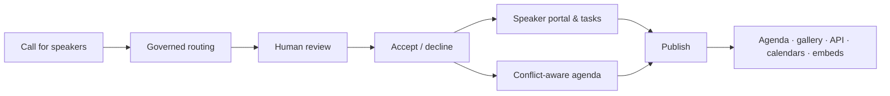

# Rostrum documentation

Rostrum keeps a complicated speaker program legible—from the first proposal
to the published room schedule. This documentation separates three different
questions: how to evaluate it, how it works, and what an operator must still
prove before a production launch.



## Start here

| I am… | Read this | Outcome |
| --- | --- | --- |
| A judge or reviewer | [Judging guide](judging-guide.md) | Complete the five-minute tour or run the full interactive path |
| An event organizer | [Self-hosting manual](self-hosting.md) | Install a fresh durable workspace and become its first organizer |
| A technical reviewer | [Architecture](architecture.md) | Understand components, trust boundaries, persistence, and limitations |
| An integration author | [API reference](api.md) | Consume the published event directory, schedule, and speakers |
| An operator | [Deployment reference](deployment.md) | Extend a deployment with Kubernetes, external projections, or the observer example |
| A release owner | [Launch readiness](launch-readiness.md) | Collect the evidence still required for a production decision |
| A contributor or designer | [Visual system](visual-system.md) | Preserve Rostrum's Paper & Ink editorial field guide |

## Evaluation paths

The fictional evaluation fixture lives only under `examples/demo/`; generic
Rostrum defaults stay fresh. Use the judge path for a complete, read-only
five-persona workspace. Use the live path to create a first organizer and test
mutations from a clean starter CFP. The hosted preview is a separate read-only
deployment and should be used only after its preflight passes.

```bash
# Deterministic read-only judge path
make judge-demo

# Fresh, disposable organizer path
APP_MODE=live make dev

# Convenience preview preflight
curl -fsS https://rostrum.m31labs.dev/api/health
curl -fsS https://rostrum.m31labs.dev/api/v1/workspace
```

The fresh live command prints the local one-time `/setup?token=…` URL. Open
that exact URL to create the first organizer. The
[judging guide](judging-guide.md) explains the expected output and fallback
behavior.

## Product map



Every stage reads and writes the same validated workspace. Rostrum does not
maintain a second publishing database.

## Source landmarks

| Area | Location |
| --- | --- |
| File-routed pages and server actions | [`app/`](https://github.com/M31-Labs/rostrum/tree/main/app/) |
| Domain state and invariants | [`internal/domain/`](https://github.com/M31-Labs/rostrum/tree/main/internal/domain/) |
| JSON, SQLite, and Postgres stores | [`internal/store/`](https://github.com/M31-Labs/rostrum/tree/main/internal/store/) |
| Public serialization boundary | [`internal/publicapi/`](https://github.com/M31-Labs/rostrum/tree/main/internal/publicapi/) |
| Policy source and adapter | [`rules/`](https://github.com/M31-Labs/rostrum/tree/main/rules/) |
| Production manifests | [`deploy/k8s/`](https://github.com/M31-Labs/rostrum/tree/main/deploy/k8s/) |
| Fictional evaluation example and smoke test | [`examples/demo/`](https://github.com/M31-Labs/rostrum/tree/main/examples/demo/) |
| Size and runtime budgets | [`size-budget.json`](https://github.com/M31-Labs/rostrum/blob/main/size-budget.json), [`perf-budget.json`](https://github.com/M31-Labs/rostrum/blob/main/perf-budget.json) |

## Honest status

The repository contains a complete credential-free local workflow and a
fail-closed configuration for a fictional read-only preview. Credential-backed
email, a chosen external database endpoint, live Accelevents/Airtable
publishing, backup recovery, and the exact hosted release still require
operator acceptance. No document in this directory treats a unit test or
example outbox entry as proof of an external provider.
